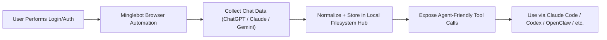

# Minglebot

  

  <strong>Centralize personal data on your local filesystem, then make it usable by AI agents.</strong>

  
  
  

  <em>Browser-use + TypeScript automation for personal data aggregation and practical tool-calling workflows.</em>

## Mission

Minglebot is an open-source project to build a single, structured local data hub for personal AI workflows.

Phase 1 is clear and concrete:

- Collect chat data from ChatGPT, Claude, and Gemini
- Normalize and organize it into one local filesystem location
- Make it directly usable by personal agent systems

Initial emphasis:

- Ensure personal data is explorable by user-owned AI agents through basic bash primitives (`grep`, `find`, etc.).
- Keep storage layout and file formats simple enough for fast terminal-level retrieval and chaining.

After this foundation, the scope expands toward broader personal data domains.

## Why This Matters

Centralization alone is not enough, especially for non-developers.

If data only gets dumped into a folder, the practical value stays low.  
Minglebot therefore treats tool-calling integration as a first-class product concern.

Target usage includes personal agent environments such as:

- Claude Code
- Claude Cowork
- Codex
- OpenClaw
- Other custom/local agent stacks

## Product Principles

1. Local-first by default: user keeps ownership of raw files.
2. Usability for non-developers: minimal-click workflows.
3. Agent-ready structure: data should be queryable and callable.
4. Practical security boundary: user performs login/authorization steps manually; repetitive post-auth work is automated.

## Scope Boundary (Important)

Minglebot does not try to automate everything:

- User handles sensitive auth actions directly (login, grant, verification).
- Minglebot automates the remaining repeatable collection and organization steps.

This keeps the system realistic, safer, and easier to maintain.

## High-Level Flow

## Tech Direction

- Primary language: TypeScript
- Automation style: browser-use based workflows
- Storage model: local filesystem as source of truth

## Roadmap

1. Reliable ingestion pipeline for ChatGPT/Claude/Gemini chat data
2. Common local schema + metadata normalization
3. Tool-calling surface for personal agent systems
4. Expansion beyond chat into broader personal data

## Status

Early-stage repository.  
Current focus is mission definition and architecture setup for implementation.

Architecture draft: [`docs/architecture-v1.md`](./docs/architecture-v1.md)

## Contributing

If you care about local-first personal AI systems, data ownership, and practical agent workflows, contributions are welcome.
