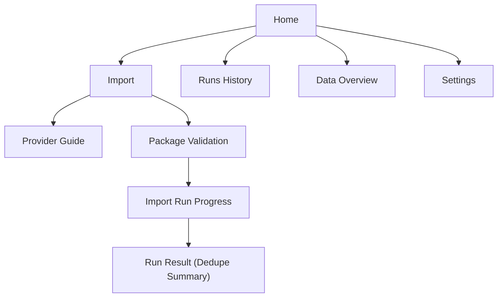

# MingleBot UI/UX Spec v1

Last updated: 2026-02-13

## 1. Scope

This spec defines v1 UI/UX for MingleBot's manual batch import model.

v1 baseline:

1. User exports data from provider manually.
2. User downloads export package manually.
3. User imports package into MingleBot.
4. MingleBot validates, extracts, deduplicates, and updates local dataset.

## 2. Product goals

1. Non-developers can complete import in under 3 minutes.
2. Repeated full exports do not feel risky (clear dedupe/upsert behavior).
3. Users can immediately understand where data is stored and how to use it.

Non-goals for v1:

- No automatic login/export/email automation
- No mandatory CLI workflow
- No cloud account dependency

## 3. UX principles

1. Local-first clarity: always show local data root and "runs on your machine."
2. Guided but not blocking: provider instructions are one click away.
3. Deterministic feedback: every import shows status, counters, and dedupe result.
4. Recoverable errors: every failed step includes exact fix action.
5. Agent-ready handoff: surface quick commands for `rg`/`jq` right after import.

## 4. Primary user journeys

### 4.1 First import journey

1. Open app.
2. Choose provider.
3. Open provider export guide.
4. Download package manually.
5. Drop package into import zone.
6. Confirm import.
7. Review dedupe summary and dataset location.

### 4.2 Repeated import journey

1. Open app.
2. Drop new full-export package.
3. Watch dedupe/upsert progress.
4. Verify "new vs updated vs unchanged" summary.

## 5. Information architecture

Top-level navigation:

- `Home`
- `Import`
- `Runs`
- `Data`
- `Settings`

Screen map:



## 6. Core screens

## 6.1 Home

Purpose:

- Give one obvious next action: "Import new export package."

Content:

- Current data root path
- Last successful import time
- Provider coverage status (ChatGPT / Claude / Gemini)
- Primary CTA: `Start Import`

Wireframe:

```text
+-----------------------------------------------------------+
| MingleBot                                                 |
| Local Data Root: /Users/<user>/MingleData                |
| Last Import: 2026-02-13 18:20                            |
|-----------------------------------------------------------|
| Provider Status                                           |
| [ChatGPT: Ready] [Claude: Ready] [Gemini: Partial]       |
|                                                           |
| [ Start Import ]                                          |
|                                                           |
| Recent Runs                                               |
| - 2026-02-13 ChatGPT   SUCCESS  +42 new / +311 updated   |
| - 2026-02-12 Claude    SUCCESS  +12 new / +58 updated    |
+-----------------------------------------------------------+
```

## 6.2 Import

Purpose:

- Complete one provider import with minimal confusion.

Layout:

- Stepper with 4 steps:
  1. Pick provider
  2. Open export guide
  3. Upload package
  4. Confirm run

Key UI blocks:

- Provider cards with `Open export page` button
- Drag-and-drop upload zone
- Validation report (filename, size, provider detection, format)
- Import options:
  - `Retain downloaded package` (default: off)
  - `Dry run (validate only)` (default: off)

## 6.3 Import run progress

Purpose:

- Make long-running processing transparent and trustworthy.

Progress stages:

1. `PACKAGE_SELECTED`
2. `PACKAGE_VALIDATED`
3. `EXTRACTED_TO_RAW`
4. `PARSED_PROVIDER_RECORDS`
5. `MAPPED_CANONICAL_RECORDS`
6. `DEDUPED_UPSERTED`
7. `NORMALIZED`

UI elements:

- Current stage + elapsed time
- Live counters:
  - parsed records
  - deduped keys
  - upserted records
  - error count
- `View logs` button

## 6.4 Run result (dedupe summary)

Purpose:

- Explain exactly what changed after repeated full export imports.

Summary cards:

- `New records`
- `Updated existing records`
- `Unchanged records`
- `Conflicts`
- `Failed records`

Actions:

- `Open Data Folder`
- `Copy Agent Commands`
- `View Run JSON`

Example summary:

```text
Import Result: SUCCESS
Provider: ChatGPT
New: 118
Updated: 1,542
Unchanged (deduped): 5,881
Conflicts: 3
Failed: 0
```

## 6.5 Runs

Purpose:

- Provide audit trail and confidence.

Columns:

- run id
- provider
- started at
- duration
- status
- new / updated / unchanged / failed

Detail drawer:

- source package info
- raw extracted path
- canonical counts
- error snippets

## 6.6 Data

Purpose:

- Help users and their agents consume centralized data right away.

Sections:

- canonical path
- provider path
- blobs path
- quick command snippets (`rg`, `jq`, `find`)

## 7. Content and microcopy

Tone:

- plain and operational
- explicit about local execution
- no technical jargon unless needed

Key copy examples:

- `Runs only on your machine. No cloud upload.`
- `This import will merge with existing data and remove duplicates by stable keys.`
- `Full export imported. Existing records were updated, not duplicated.`

## 8. Error UX

Error classes:

1. unsupported package format
2. provider mismatch
3. corrupted archive
4. schema mapping failure
5. write permission failure

For each error, provide:

- what happened
- exact next action
- optional advanced logs

Example:

- `Provider mismatch: selected Claude but package looks like ChatGPT export.`
- `Action: switch provider to ChatGPT or upload a Claude export package.`

## 9. Accessibility and desktop behavior

Accessibility:

- keyboard-first flow for all import actions
- color is never the only status signal
- minimum 4.5:1 text contrast

Desktop behavior:

- responsive from 1024px and above
- single-column fallback for narrow windows
- never hide critical status behind hover-only interactions

## 10. Success metrics (v1)

1. Import success rate
2. Median time-to-first-successful-import
3. Repeat import success rate
4. Dedupe confidence (unchanged records correctly recognized)
5. User-triggered support logs per 100 imports

## 11. Out of scope for v1.5+

Candidate next steps:

- provider export assistant automation
- email connector automation (optional)
- scheduled reminders for batch import
- conflict resolution UI for ambiguous records
